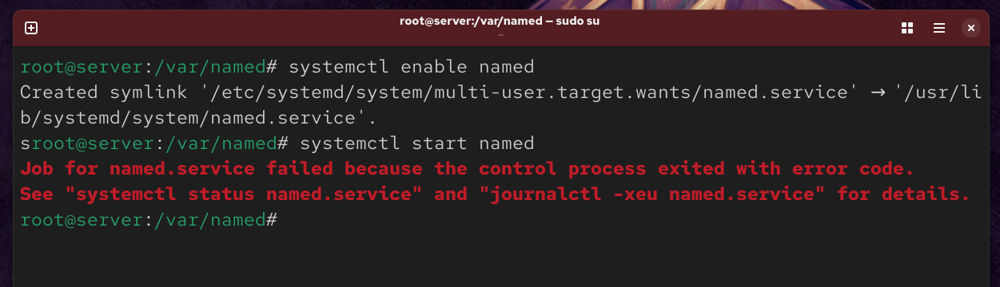
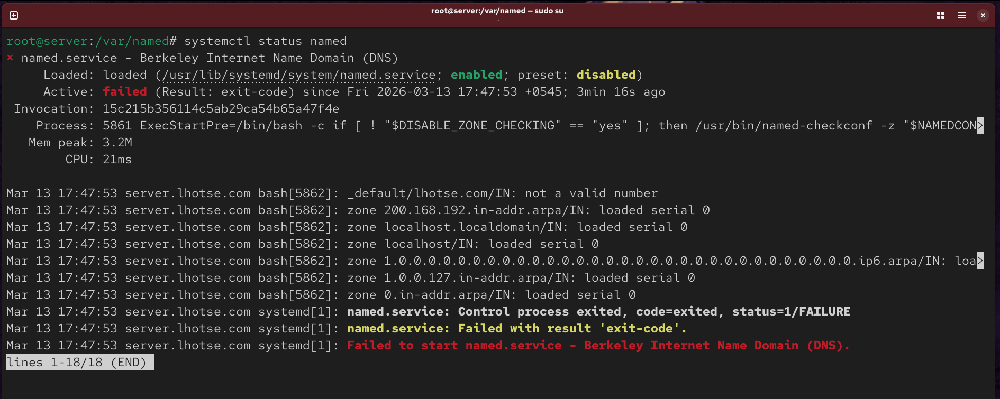
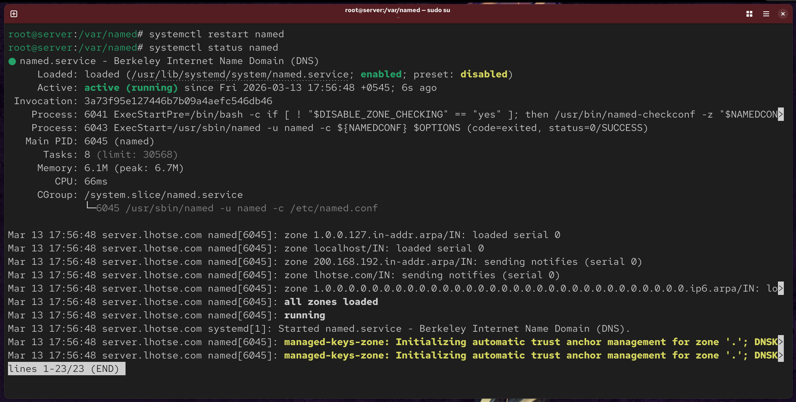
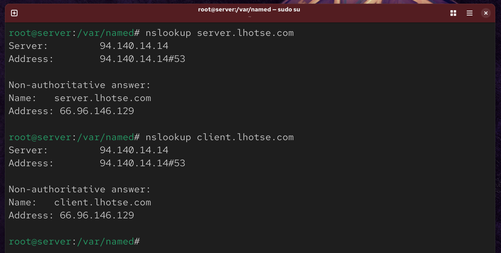
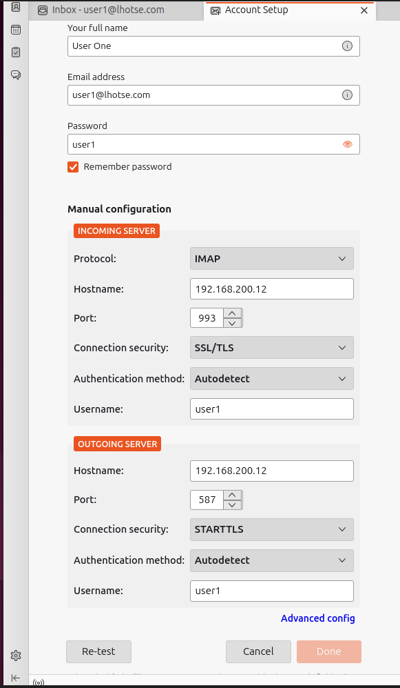
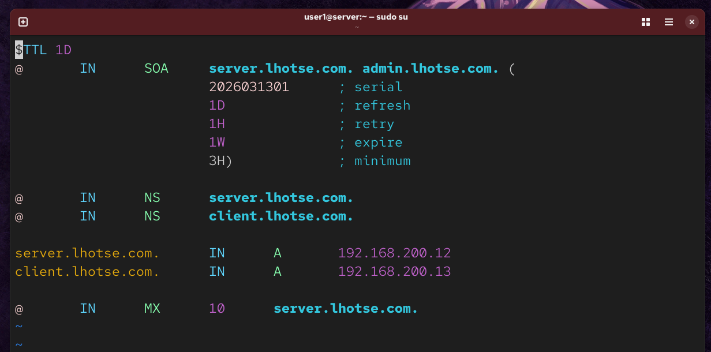

## Errors

### 1. 1st error encountered in named

Issue was the serial number on the forward and reverse lookup zone file
Serial was set to 0.
Fixed by adding a serial: 2026130310 instead of 0

## 2. 2nd Error encountered when doing nslookup

Error was when nslookup was ran on server and client domain
it returned wrong ip
instead of 192.168.200.13 and 192.168.200.12
it returned 66.96.146.129

After doing some online research, we found out that:

- The DNS resolver reads `/etc/resolv.conf` from **top to bottom**
- It only tries the next nameserver if the first one doesn't respond.
  Our resolv.conf file
  
  Our resolv.conf file has some Adguard Nameserver. Since is reads in top-bottom approach, when we do nslookup it actually asks that nameserver instead of 192.168.200.12.
  Since lhotse.com is a real public domain. It returned the real domain ip.

Fix: just move our nameserver on the top so it grabs our private nameserver instead of adguard's nameserver

We restarted the bind `systemctl restart named` and tried the nslookup once again

## 3. 3rd Error encountered during configuring thunderbird on Ubuntu (Client)

Error: couldn't add the user1 and user2 account on thunderbird
Cause: No MX DNS record for mail

Fixed by adding MX record on fwd.lhotse.com file

## 4. error encountered when starting vsftpd after configuration

Cause: typo in vsftpd config file, written passv instead of pasv

Fix: fixed the typo

## 5. 5th error encountered on same vsftpd

Cause: another typo on vsftpd config file, written allow_writable_chroot instead of allow_writeable_chroot
Fix:

